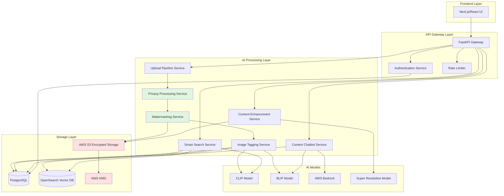

# Design Document: StarkVision AI

## Overview

StarkVision AI is a privacy-first, AI-powered image gallery platform built on a microservices architecture. The system prioritizes user privacy through automatic metadata removal, AI-resistant watermarking, and zero-data-sharing policies while providing intelligent search and content management capabilities.

The platform consists of four primary layers:
1. **Frontend Layer**: Next.js/React application providing the user interface
2. **API Gateway Layer**: FastAPI backend handling authentication, routing, and business logic
3. **AI Processing Layer**: Specialized services for image analysis, search, and enhancement
4. **Storage Layer**: Encrypted storage (AWS S3) and databases (PostgreSQL, OpenSearch)

All AI processing occurs within the platform's infrastructure using self-hosted models (CLIP, BLIP) and AWS Bedrock, ensuring no user data leaves the controlled environment.

## Architecture

### System Architecture Diagram



### Component Responsibilities

**Frontend Layer:**
- User interface for upload, search, gallery management
- Image preview and download
- Chatbot interaction interface
- Real-time upload progress tracking

**API Gateway Layer:**
- Request routing and load balancing
- JWT-based authentication and authorization
- Rate limiting (100 requests/minute per user)
- Input validation and sanitization
- CORS and security headers management

**AI Processing Layer:**

*Upload Pipeline Service:*
- Accepts image uploads via multipart form data
- Validates file type, size, and format
- Orchestrates the privacy and watermarking pipeline
- Manages upload state and error recovery
- Supports resumable uploads for large files

*Privacy Processing Service:*
- Extracts EXIF and metadata from images
- Classifies metadata as sensitive or non-sensitive
- Removes GPS coordinates, timestamps, device identifiers
- Preserves user-specified metadata when requested
- Validates complete removal of sensitive data

*Watermarking Service:*
- Applies frequency-domain watermarking using DCT (Discrete Cosine Transform)
- Embeds imperceptible patterns that degrade AI model performance
- Maintains PSNR > 40dB for human-imperceptible quality
- Generates both watermarked and original versions
- Validates watermark robustness against common AI attacks

*Image Tagging Service:*
- Processes images through CLIP for semantic embeddings
- Uses BLIP for caption generation and object detection
- Generates descriptive tags with confidence scores
- Filters tags below 0.7 confidence threshold
- Stores embeddings in OpenSearch and metadata in PostgreSQL

*Smart Search Service:*
- Converts text queries to CLIP embeddings
- Performs approximate nearest neighbor search in OpenSearch
- Combines vector similarity with metadata filtering
- Ranks results by cosine similarity
- Supports multimodal queries (text + partial image)

*Context Chatbot Service:*
- Accepts natural language questions about images
- Uses BLIP for visual question answering
- Leverages AWS Bedrock (Claude) for conversational responses
- Maintains conversation context within session
- Responds only based on visual information (no metadata leakage)

*Content Enhancement Service:*
- Applies AI-based color grading using learned models
- Performs super-resolution upscaling (2x, 4x)
- Maintains aspect ratio and visual fidelity
- Creates new versions without modifying originals
- Processes asynchronously with status tracking

**Storage Layer:**

*AWS S3 Encrypted Storage:*
- Stores encrypted images using AES-256
- Server-side encryption with AWS KMS
- Separate buckets for original and watermarked versions
- Lifecycle policies for deleted image cleanup
- Versioning disabled for privacy

*PostgreSQL:*
- User accounts and authentication data
- Image metadata (non-sensitive only)
- Tags and confidence scores
- Enhancement job status
- Audit logs for security events

*OpenSearch Vector Database:*
- Stores CLIP embeddings (512-dimensional vectors)
- Approximate nearest neighbor search using HNSW algorithm
- Indexed by user_id and image_id
- Supports hybrid search (vector + keyword)

*AWS KMS:*
- Manages encryption keys per user
- Automatic key rotation every 90 days
- Separate keys for storage and database encryption

## Components and Interfaces

### Upload Pipeline Service

**Interface:**
```python
class UploadPipelineService:
    async def upload_image(
        self,
        user_id: str,
        file: UploadFile,
        preserve_metadata: Optional[List[str]] = None
    ) -> UploadResult
    
    async def get_upload_status(
        self,
        user_id: str,
        upload_id: str
    ) -> UploadStatus
    
    async def resume_upload(
        self,
        user_id: str,
        upload_id: str,
        chunk: bytes,
        offset: int
    ) -> UploadResult
```

**UploadResult:**
```python
@dataclass
class UploadResult:
    image_id: str
    status: str  # "processing", "complete", "failed"
    watermarked_url: Optional[str]
    original_url: Optional[str]
    tags: List[Tag]
    error: Optional[str]
```

### Privacy Processing Service

**Interface:**
```python
class PrivacyProcessingService:
    def extract_metadata(self, image_bytes: bytes) -> ImageMetadata
    
    def classify_metadata(
        self,
        metadata: ImageMetadata
    ) -> Tuple[Dict[str, Any], Dict[str, Any]]  # (sensitive, non_sensitive)
    
    def remove_sensitive_metadata(
        self,
        image_bytes: bytes,
        preserve_fields: Optional[List[str]] = None
    ) -> bytes
    
    def verify_metadata_removal(
        self,
        processed_image: bytes
    ) -> bool
```

**ImageMetadata:**
```python
@dataclass
class ImageMetadata:
    exif_data: Dict[str, Any]
    gps_coordinates: Optional[Tuple[float, float]]
    timestamp: Optional[datetime]
    device_info: Optional[str]
    camera_serial: Optional[str]
    custom_fields: Dict[str, Any]
```

### Watermarking Service

**Interface:**
```python
class WatermarkingService:
    def apply_watermark(
        self,
        image_bytes: bytes,
        strength: float = 0.1
    ) -> bytes
    
    def validate_watermark_quality(
        self,
        original: bytes,
        watermarked: bytes
    ) -> WatermarkQuality
    
    def test_ai_resistance(
        self,
        watermarked_image: bytes
    ) -> AIResistanceScore
```

**WatermarkQuality:**
```python
@dataclass
class WatermarkQuality:
    psnr: float  # Peak Signal-to-Noise Ratio
    ssim: float  # Structural Similarity Index
    human_perceptible: bool
    meets_threshold: bool
```

### Image Tagging Service

**Interface:**
```python
class ImageTaggingService:
    async def generate_tags(
        self,
        image_bytes: bytes
    ) -> List[Tag]
    
    async def generate_embedding(
        self,
        image_bytes: bytes
    ) -> np.ndarray  # 512-dimensional CLIP embedding
    
    async def generate_caption(
        self,
        image_bytes: bytes
    ) -> str
```

**Tag:**
```python
@dataclass
class Tag:
    label: str
    confidence: float
    category: str  # "object", "scene", "activity", "color"
```

### Smart Search Service

**Interface:**
```python
class SmartSearchService:
    async def search_by_text(
        self,
        user_id: str,
        query: str,
        limit: int = 20,
        filters: Optional[SearchFilters] = None
    ) -> List[SearchResult]
    
    async def search_by_image(
        self,
        user_id: str,
        image_bytes: bytes,
        limit: int = 20
    ) -> List[SearchResult]
    
    async def search_multimodal(
        self,
        user_id: str,
        text_query: str,
        image_bytes: Optional[bytes],
        filters: Optional[SearchFilters] = None
    ) -> List[SearchResult]
```

**SearchResult:**
```python
@dataclass
class SearchResult:
    image_id: str
    similarity_score: float
    thumbnail_url: str
    tags: List[Tag]
    caption: str
```

### Context Chatbot Service

**Interface:**
```python
class ContextChatbotService:
    async def ask_question(
        self,
        user_id: str,
        image_id: str,
        question: str,
        conversation_history: Optional[List[Message]] = None
    ) -> ChatResponse
    
    async def analyze_visual_context(
        self,
        image_bytes: bytes
    ) -> VisualContext
```

**ChatResponse:**
```python
@dataclass
class ChatResponse:
    answer: str
    confidence: float
    visual_evidence: List[str]  # Descriptions of visual elements supporting the answer
    uncertainty: bool
```

**VisualContext:**
```python
@dataclass
class VisualContext:
    scene_type: str
    objects: List[str]
    activities: List[str]
    lighting: str
    weather: Optional[str]
    time_of_day: Optional[str]
```

### Content Enhancement Service

**Interface:**
```python
class ContentEnhancementService:
    async def apply_color_grading(
        self,
        user_id: str,
        image_id: str,
        style: Optional[str] = "auto"
    ) -> EnhancementJob
    
    async def upscale_resolution(
        self,
        user_id: str,
        image_id: str,
        scale_factor: int = 2
    ) -> EnhancementJob
    
    async def get_job_status(
        self,
        user_id: str,
        job_id: str
    ) -> EnhancementJob
```

**EnhancementJob:**
```python
@dataclass
class EnhancementJob:
    job_id: str
    status: str  # "queued", "processing", "complete", "failed"
    original_image_id: str
    enhanced_image_id: Optional[str]
    progress: float  # 0.0 to 1.0
    error: Optional[str]
```

## Data Models

### User Model

```python
@dataclass
class User:
    user_id: str  # UUID
    email: str
    password_hash: str  # bcrypt hashed
    created_at: datetime
    last_login: Optional[datetime]
    encryption_key_id: str  # AWS KMS key ID
    storage_quota_mb: int
    storage_used_mb: float
    account_status: str  # "active", "locked", "deleted"
```

### Image Model

```python
@dataclass
class Image:
    image_id: str  # UUID
    user_id: str
    original_filename: str
    file_format: str  # "jpeg", "png", "heic", "webp"
    file_size_bytes: int
    width: int
    height: int
    uploaded_at: datetime
    s3_original_key: str
    s3_watermarked_key: str
    embedding_vector: Optional[np.ndarray]  # Stored in OpenSearch
    tags: List[Tag]
    caption: str
    is_deleted: bool
    deleted_at: Optional[datetime]
```

### SearchIndex Model (OpenSearch)

```python
{
    "image_id": "string",
    "user_id": "string",
    "embedding": [float],  # 512-dimensional vector
    "tags": ["string"],
    "caption": "string",
    "uploaded_at": "timestamp"
}
```

### AuditLog Model

```python
@dataclass
class AuditLog:
    log_id: str
    user_id: str
    action: str  # "upload", "search", "delete", "login", "failed_auth"
    timestamp: datetime
    ip_address: str
    user_agent: str
    success: bool
    details: Optional[Dict[str, Any]]
```

## Data Flow

### Image Upload Flow

1. User uploads image through Next.js UI
2. Frontend sends multipart POST to `/api/v1/images/upload`
3. API Gateway validates JWT token and rate limit
4. Upload Pipeline Service receives file and creates upload record
5. Privacy Processing Service extracts and removes sensitive metadata
6. Watermarking Service applies frequency-domain watermark
7. Both original and watermarked images encrypted with user's KMS key
8. Encrypted images stored in separate S3 buckets
9. Image Tagging Service generates CLIP embedding and tags
10. Embedding stored in OpenSearch, metadata in PostgreSQL
11. Upload Pipeline returns image_id and URLs to frontend

### Search Flow

1. User enters search query in UI
2. Frontend sends GET to `/api/v1/search?q={query}`
3. API Gateway validates authentication
4. Smart Search Service converts query to CLIP embedding
5. OpenSearch performs approximate nearest neighbor search
6. Results filtered by user_id for privacy isolation
7. Top 20 results ranked by cosine similarity
8. PostgreSQL queried for image metadata
9. Thumbnail URLs generated with temporary S3 presigned URLs
10. Results returned to frontend with similarity scores

### Chatbot Interaction Flow

1. User selects image and asks question
2. Frontend sends POST to `/api/v1/chatbot/ask` with image_id and question
3. API Gateway validates authentication and retrieves image from S3
4. Context Chatbot Service decrypts image
5. BLIP model analyzes image for visual question answering
6. Visual context extracted (scene, objects, lighting, etc.)
7. AWS Bedrock (Claude) generates natural language response
8. Response includes confidence score and visual evidence
9. Conversation history maintained in session for follow-up questions
10. Response returned to frontend

## Technology Stack Rationale

**CLIP (Contrastive Language-Image Pre-training):**
- Enables semantic image search by mapping images and text to shared embedding space
- 512-dimensional vectors provide rich semantic representation
- Supports zero-shot classification without fine-tuning
- Self-hosted for privacy (no external API calls)

**BLIP (Bootstrapping Language-Image Pre-training):**
- Generates natural language captions for images
- Supports visual question answering for chatbot
- Better at detailed image descriptions than CLIP alone
- Complements CLIP for comprehensive image understanding

**AWS Bedrock (Claude):**
- Provides conversational AI for natural chatbot responses
- Processes visual context into human-friendly answers
- Maintains conversation coherence across multiple turns
- AWS-hosted ensures data stays within controlled environment

**OpenSearch:**
- Vector database optimized for similarity search
- HNSW algorithm provides fast approximate nearest neighbor search
- Scales horizontally for large image collections
- Supports hybrid search (vector + keyword filtering)

**PostgreSQL:**
- Reliable relational database for structured data
- ACID compliance ensures data integrity
- Supports complex queries for metadata filtering
- Mature ecosystem with strong security features

**FastAPI:**
- High-performance async Python framework
- Automatic OpenAPI documentation
- Built-in request validation with Pydantic
- Native async/await support for concurrent processing

**Next.js/React:**
- Server-side rendering for fast initial page loads
- React for component-based UI development
- TypeScript for type safety
- TailwindCSS for rapid, consistent styling

**AWS Lambda:**
- Serverless compute for AI processing tasks
- Automatic scaling based on load
- Pay-per-use pricing model
- Integrates seamlessly with S3 and KMS

**AWS KMS:**
- Centralized key management
- Automatic key rotation
- Audit logging for compliance
- Hardware security modules (HSM) for key protection

## Correctness Properties

*A property is a characteristic or behavior that should hold true across all valid executions of a system—essentially, a formal statement about what the system should do. Properties serve as the bridge between human-readable specifications and machine-verifiable correctness guarantees.*

